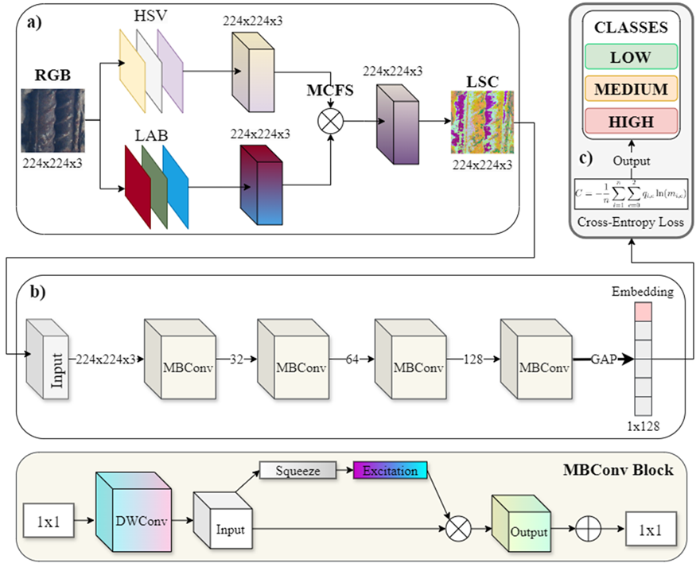

# BriCANet Classifier - GUI Application 🧠

Welcome to **BriCANet**, a powerful GUI application for corrosion intensity classification in RC structures images using deep learning. 
This guide will help you create a standalone executable from the Python source code.

📸 *BriCANET Framework*  
  

---

## 🚀 Quick Start - Create Your Executable

### 📂 1. Prepare the files

1. Create a folder on your computer (example: `C:\BriCANet\`)  
2. Save the file **BriCANet_GUI.py** inside this folder  
3. Save the file **requirements.txt** inside this folder  


### ⚙️ 2. Install everything you need

1. Open the Command Prompt (CMD): type `cmd` and press **Enter**  
     

2. Navigate to the project folder:
   ```bash
   cd C:\BriCANet
   ```

3. Install the required Python libraries with: 
   ```bash
   pip install -r requirements.txt
   ```

4. Install PyInstaller (to create the executable) with:
   ```bash
   pip install pyinstaller
   ```


### 🛠️ 3. Create the executable 

1. Run this command in the terminal:
   ```bash
   pyinstaller --onefile --windowed --name="BriCANet_Classifier" --clean --noconsole --hidden-import=tensorflow --hidden-import=pil BriCANet_GUI.py
   ```

⏳ Wait until PyInstaller finishes…

🎉 Done! BriCANet is ready to use!

---

# 📊 Expected Folder Structure
   ```bash
C:\BriCANet\
├── 📄 BriCANet_GUI.py          (Main application code)
├── 📄 requirements.txt         (Dependencies list)
├── 📁 dist/
│   └── 🎯 BriCANet_Classifier.exe  (#Your final executable!)
└── 📁 build/                   (Temporary build files)
```

## 🚀 How to Use the App

1. Launch the application by running the Python file.  
2. Load the `.h5` model using the dedicated button.  
   - You can create this model by training it with the **`BriCANET_training.py`** script on your chosen dataset.  
3. For each face:  
   - Select **"Corrosion Detected"** if corrosion is present.  
   - Upload the corresponding image.  
4. Click **"Run Full Analysis"** to generate all results.   

---

## ⚠️ Important Disclaimer & Development Status


### 🔬 Research Development Phase
BriCANet is currently in active development and improvement phase, so this tool should be considered as a research prototype.

### 📚 Academic References
@article{XXXXXXXXXXXXX,
  title={XXXXXXXXXXXXXXXXXXX},
  author={XXXXXXXXXXXXXXX},
  journal={XXXXXXXXXXXXXXXX},
  year={2025},
  publisher={XXXXXXXXXXXXXXXXXXXX}
}

### 🏆 Institutions & Collaborators
University/Affiliation: 

<div align="center">
Dipartimento di Ingegneria Civile, Ambientale, del Territorio, Edile e di Chimica
Politecnico di Bari
Via Orabona 4, Bari, 70126, Italy

Istituto di Sistemi e Tecnologie Industriali Intelligenti per il Manifatturiero Avanzato
Consiglio Nazionale delle Ricerche (CNR)
Via Amendola 122 D/O, Bari, 70126, Italy

</div>

### ⭐ Star this repo if you found it helpful!
